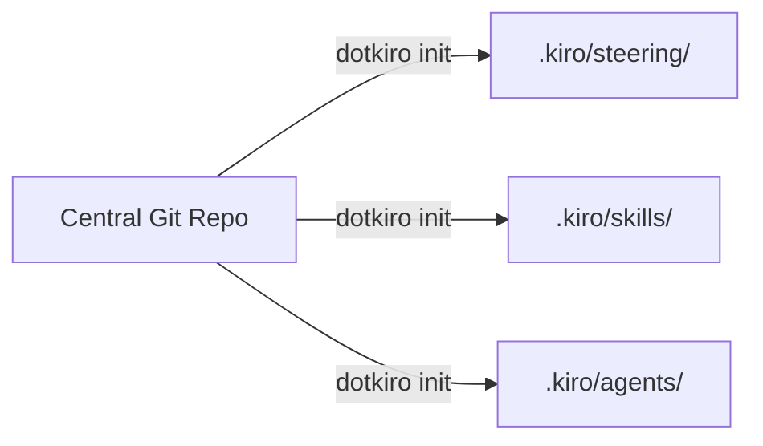
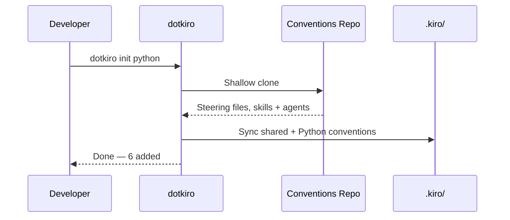

# Keep Your Team's AI Coding Conventions in Sync with Kiro

When a team adopts an AI coding assistant like [Kiro](https://kiro.dev), something interesting happens. Developers start writing steering files — markdown documents that tell the AI how to write code, what patterns to follow, and what to avoid. They create skills — reusable instructions for common tasks like code reviews or deployment checks. They build custom agents — specialized assistants tuned for a particular job.

This works great for one person. But across a team of ten, twenty, or fifty developers? You end up with a dozen slightly different versions of the same rules, scattered across projects, copy-pasted from Slack, and slowly drifting apart.

## The problem

Kiro reads steering files from `.kiro/steering/`, skills from `.kiro/skills/`, and custom agents from `.kiro/agents/` inside your project. These files shape how the AI behaves — your code style preferences, testing conventions, security rules, specialized assistants, and more.

Without a system in place, teams hit a few common issues:

- New projects start with no conventions, or outdated ones copied from an old repo
- Updates to a rule require manually editing files across every active project
- Different developers have different versions of the same steering file
- There's no single source of truth for "how our team uses Kiro"

## The idea

Store your team's conventions in a single Git repository. Build a small CLI that syncs them into any project. Publish it to npm so anyone on the team can run one command to get set up.



That's the whole pattern. A Git repo becomes your single source of truth. A CLI becomes the distribution mechanism. npm makes it frictionless.

## Why types matter

Not every project needs the same conventions. A Python project has different rules than a CDK project. But they probably share the same security guidelines and code review standards.

Types solve this. Your conventions repo has shared files at the root and type-specific files in named folders. When a developer runs `dotkiro init python`, they get the shared conventions plus the Python-specific ones layered on top.

```
my-conventions/
  steering/           ← Shared rules, always pulled
    code-style.md
    security.md
  skills/             ← Shared skills, always pulled
    code-review/
      SKILL.md
  agents/             ← Shared agents, always pulled
    code-reviewer.md
    aws-expert.json
  python/             ← Extra rules for Python projects
    steering/
      python-rules.md
  cdk/                ← Extra rules for CDK projects
    steering/
      construct-patterns.md
```

A project can use multiple types. `dotkiro init python cdk` pulls shared, Python, and CDK conventions. Need to add CDK later? `dotkiro add cdk`. Want to drop it? `dotkiro remove cdk`. The tool tracks what it synced and only touches its own files — anything you created locally stays untouched.

## The developer workflow



Day to day, it looks like this:

- Starting a new project? `dotkiro init python`
- Want to keep the manifest out of source control? Add `--gitignore` and dotkiro will update your `.gitignore` for you. The manifest tracks your local sync state — it's generated, developer-specific, and shouldn't be committed since the remote repo is the source of truth.
- Team updated a convention? `dotkiro update` — it tells you what changed
- Need to check what's synced? `dotkiro status`
- Done with a type? `dotkiro remove cdk`
- Want to add your own project-specific rules? Just create new `.md` files in `.kiro/steering/` — dotkiro only manages files tracked in the manifest, so your local files are never touched, even on `remove`

## Updating conventions is a pull request

This is the part that matters most. When someone on your team wants to change a coding convention, they open a PR against the conventions repo. The team reviews it. Once merged, every developer gets the update on their next `dotkiro update`.

No Slack messages asking people to update their files. No wiki pages that go stale. No "which version of the security rules are you using?" conversations. The Git repo is the source of truth, and the CLI is the delivery mechanism.

## Sharing it with your team

Clone the repo and link it globally so anyone on the team can use it:

```bash
git clone https://github.com/kirodotdev-labs/dotkiro.git
cd dotkiro
npm link
```

Commit a `.dotkirorc` file to each project repo with the conventions repo URL and the types the project needs, and new team members don't need to know anything — they just run `dotkiro init` and they're set.

```json
{
  "repo": "https://github.com/your-org/your-kiro-conventions.git",
  "types": ["python", "cdk"]
}
```

The CLI keeps this file in sync: `dotkiro add` appends types, `dotkiro remove` strips them. You can also pin to a specific branch with `--branch`, useful for versioning your conventions (e.g. `dotkiro init python --branch=v2`).

## Where to go from here

This pattern is intentionally simple, but there's room to grow:

- Sync agent hooks from your conventions repo (Kiro supports hooks in `.kiro/hooks/`)
- Run `dotkiro init` in CI to keep conventions fresh automatically

## Wrapping up

The gap between "one developer with great AI conventions" and "a whole team with great AI conventions" doesn't require complex tooling. A Git repo, a small CLI, and npm give you a lightweight system that keeps everyone aligned. Updating a convention becomes a pull request. Onboarding a new project becomes a single command.
