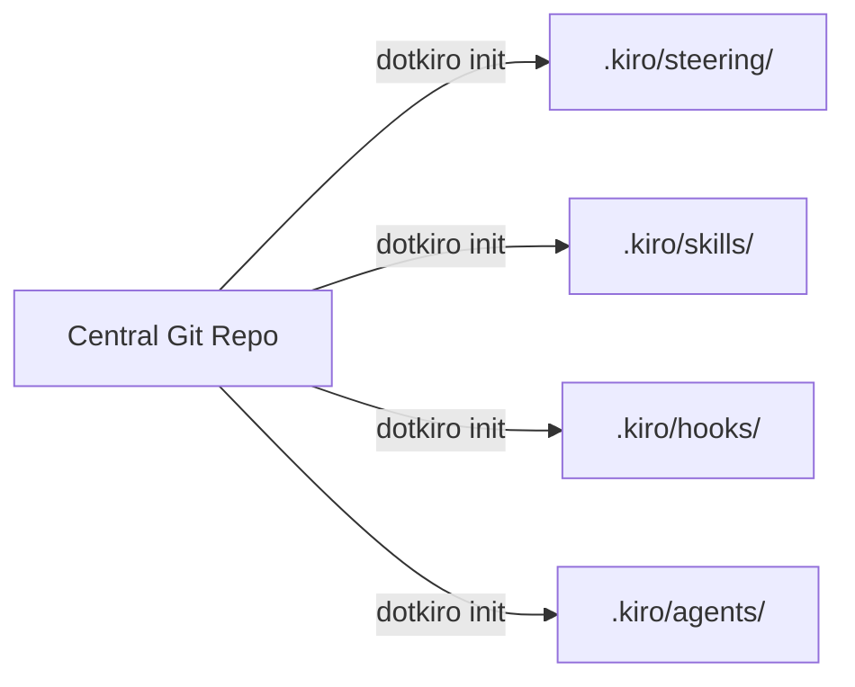

# dotkiro

Sync your team's [Kiro](https://kiro.dev) steering files, skills, agent hooks, and custom agents from a central Git repo into any project.

For a deeper walkthrough of the problem and the thinking behind dotkiro, read the [blog post](BLOG.md).


## Why

Steering files, skills, agent hooks, and custom agents shape how Kiro writes code — your style preferences, security rules, testing conventions, automated workflows, specialized assistants, and more. When these are consistent across projects, every developer on the team gets the same AI behavior. When they're not, you get drift: slightly different rules in every repo, outdated copies, new projects starting from scratch.

The problem gets worse as you scale from a team to an organisation. Updating a convention means editing files across every active project. New team members don't know which version to use. Different teams end up with their own variations. There's no single source of truth for "how we use Kiro."

dotkiro fixes that. One Git repo holds your conventions, one command syncs them everywhere.

## Requirements

- Node.js >= 18
- Git on PATH

## Quick start

```bash
git clone https://github.com/kirodotdev-labs/dotkiro.git
cd dotkiro
npm link
```

Then in any project, create a `.dotkirorc` file pointing at your team's conventions repo:

```json
{
  "repo": "https://github.com/your-org/your-kiro-conventions.git"
}
```

And sync:

```bash
dotkiro init
```

This pulls all `.md` files from the `steering/` and `skills/` directories, all `.kiro.hook` files from the `hooks/` directory, and all `.md` and `.json` files from the `agents/` directory at the root of your conventions repo into `.kiro/steering/`, `.kiro/skills/`, `.kiro/hooks/`, and `.kiro/agents/`.

Your conventions repo should follow this layout:

```
your-conventions-repo/
  steering/           ← shared, always synced
    *.md
  skills/             ← shared, always synced
    <skill-name>/
      SKILL.md
  hooks/              ← shared, always synced
    *.kiro.hook
  agents/             ← shared, always synced
    *.md
    *.json
  <type>/             ← type-specific (e.g. python, cdk, platform-team)
    steering/
      *.md
    skills/
      <skill-name>/
        SKILL.md
    hooks/
      *.kiro.hook
    agents/
      *.md
      *.json
```

Types can represent anything: languages, frameworks, teams, or environments. A type is just a named folder in your conventions repo.

To layer type-specific conventions on top, add a type:

```bash
dotkiro add python
```

This fetches files from `python/steering/`, `python/skills/`, `python/hooks/`, and `python/agents/` in the remote repo without re-syncing the shared ones. See [Repo structure](#repo-structure) for the full layout.

## Commands

### `dotkiro init [types...]`

Fetches steering files, skills, hooks, and agents from the configured remote repo and copies them into `.kiro/steering/`, `.kiro/skills/`, `.kiro/hooks/`, and `.kiro/agents/`.

- With no types and no `types` in `.dotkirorc`, syncs only the shared conventions (files at the repo root's `steering/`, `skills/`, `hooks/`, and `agents/` directories).
- With no CLI types but `types` declared in `.dotkirorc`, syncs shared plus those declared types.
- With CLI types (e.g. `dotkiro init python cdk`), syncs shared conventions plus the specified types and saves them to `.dotkirorc`.
- Creates a manifest at `.dotkiro-manifest.json` that tracks every file it placed, grouped by type.
- On repeat runs, detects files that were previously synced but are no longer present in the remote and removes them from disk and the manifest.
- Safe to run multiple times — unchanged files are skipped.

```bash
dotkiro init                    # shared only
dotkiro init python typescript  # shared + python + typescript
dotkiro init --gitignore        # also add the manifest to .gitignore
```

The manifest (`.dotkiro-manifest.json`) is generated at runtime and reflects each developer's local sync state. It shouldn't be committed — different developers may have different types active, and the remote repo is the source of truth for file contents. Use `--gitignore` on first run to keep it out of source control automatically.

### `dotkiro add <types...>`

Adds one or more types to an existing setup without re-syncing shared files.

- Requires at least one type argument.
- Only fetches and copies the type-specific directories — shared files are left as-is.
- Merges the new type entries into the existing manifest.
- Appends the new types to the `types` array in `.dotkirorc`.

```bash
dotkiro add cdk                 # layer CDK conventions on top
dotkiro add python cdk          # add multiple types at once
```

### `dotkiro update`

Re-syncs all previously configured types from the remote repo.

- Reads the manifest to discover which types were set up, then runs the equivalent of `dotkiro init` with those types.
- Picks up new files, updates changed files, and removes files that were deleted from the remote.
- Accepts `--repo` and `--branch` flags to override config for this run.
- Does nothing if no manifest exists (tells you to run `init` first).

```bash
dotkiro update
dotkiro update --branch=v2
```

### `dotkiro remove [types...]`

Removes synced files from disk and updates the manifest.

- With type arguments (e.g. `dotkiro remove python`), removes only the files belonging to those types and removes them from the `types` array in `.dotkirorc`. Files shared with a type you're keeping are left in place.
- With no arguments, removes everything dotkiro synced, deletes the manifest, and clears `types` from `.dotkirorc`.

```bash
dotkiro remove typescript       # drop one type
dotkiro remove python cdk       # drop multiple types
dotkiro remove                  # remove everything
```

### `dotkiro status`

Shows what's currently synced — lists each type and its file count.

```bash
dotkiro status
```

### Global options

```
--repo <url>     Git repo URL (overrides .dotkirorc)
--branch <name>  Branch to clone (default: main)
--gitignore      Add the manifest to .gitignore (if the file exists and the entry is missing)
-h, --help       Show help
```

## How it works



`dotkiro init` shallow-clones your configured repo and copies `.md` files into `.kiro/steering/` and `.kiro/skills/`, `.kiro.hook` files into `.kiro/hooks/`, and agent files into `.kiro/agents/`. Agents can be either `.md` (markdown subagents) or `.json` (CLI agent configs).

Types let you layer conventions. Shared files are always synced, and each type adds its own on top.

### The manifest

dotkiro creates a `.dotkiro-manifest.json` file in your project root. This is a local tracking file that records every file dotkiro placed on disk, grouped by type. It's how the tool knows:

- Which files to update when you run `dotkiro update`
- Which files to delete when you run `dotkiro remove`
- Which files belong to which type

Files you create manually in `.kiro/steering/`, `.kiro/skills/`, `.kiro/hooks/`, or `.kiro/agents/` are never in the manifest, so dotkiro will never touch them. Only files that came from the central repo are tracked and managed.

The manifest reflects your local sync state and shouldn't be committed — different developers may have different types active. Use `dotkiro init --gitignore` to exclude it automatically.

## Updating conventions

When someone on your team changes a convention, they open a PR against the conventions repo. The team reviews it. Once merged, every developer gets the update on their next `dotkiro update` — it reports what was added, changed, or removed.

No Slack messages asking people to update their files. No wiki pages that go stale. The Git repo is the source of truth, and the CLI is the delivery mechanism.

## Repo structure

For a working example, see [kiro-centralised-config](https://github.com/aurelienaws/kiro-centralised-config).

Your central repo should look like this:

```
my-repo/
  steering/                    # Shared — always pulled
    code-style.md
    security.md
  skills/                      # Shared — always pulled
    code-review/
      SKILL.md
  hooks/                       # Shared — always pulled
    lint-on-save.kiro.hook
  agents/                      # Shared — always pulled
    code-reviewer.md           # markdown subagent
    aws-expert.json            # CLI agent config
  python/                      # Type-specific
    steering/
      python-rules.md
    skills/
      pytest-helper/
        SKILL.md
    hooks/
      run-pytest.kiro.hook
    agents/
      py-refactorer.json
```

### Where files end up

Running `dotkiro init python` produces:

```
.kiro/
  steering/
    code-style.md              ← from steering/
    security.md                ← from steering/
    python/
      python-rules.md          ← from python/steering/
  skills/
    code-review/
      SKILL.md                 ← from skills/
    pytest-helper/
      SKILL.md                 ← from python/skills/
  hooks/
    lint-on-save.kiro.hook     ← from hooks/
    python/
      run-pytest.kiro.hook     ← from python/hooks/
  agents/
    code-reviewer.md           ← from agents/
    aws-expert.json            ← from agents/
    py-refactorer.json         ← from python/agents/
```

Steering supports subfolders in Kiro, so type-specific steering goes into `.kiro/steering/<type>/`. Skills only work one level deep, so they're flattened into `.kiro/skills/` regardless of source. Hooks support nesting, so type-specific hooks go into `.kiro/hooks/<type>/`. Agents are flat files in `.kiro/agents/`, so type-specific agents are flattened there alongside the shared ones.

### Local files are safe

Files you create locally in `.kiro/steering/`, `.kiro/skills/`, `.kiro/hooks/`, or `.kiro/agents/` are never touched by dotkiro. Only files tracked in the manifest are managed.

## Configuration

Create a `.dotkirorc` file in your project (or `~/.config/dotkiro/config.json` for global defaults):

```json
{
  "repo": "https://github.com/your-org/your-kiro-repo.git"
}
```

Optionally declare the types your project needs and a branch:

```json
{
  "repo": "https://github.com/your-org/your-kiro-repo.git",
  "branch": "main",
  "types": ["python", "cdk"]
}
```

A sample `.dotkirorc` is available in the [`examples/`](examples/) directory.

Commit this file to your repo. When a new developer clones the project and runs `dotkiro init`, it reads the `types` from `.dotkirorc` and syncs everything automatically — no need to remember which types to pass.

The `types` array is kept in sync by the CLI: `dotkiro add cdk` appends `cdk`, `dotkiro remove cdk` removes it. You can also edit it by hand.

CLI flags override config. Config is resolved in layers: defaults -> user config (`~/.config/dotkiro/config.json`) -> project config (`.dotkirorc`) -> CLI flags, so you can set org-wide defaults and override per-project or per-command.

```bash
dotkiro init python --repo=https://github.com/your-org/repo.git --branch=v2
```

## Troubleshooting

**"No repo configured"** — You haven't set a repo URL. Add it to `.dotkirorc`, pass `--repo`, or set it in `~/.config/dotkiro/config.json`.

**"No dotkiro manifest found. Run `dotkiro init` first."** — You ran `dotkiro update` or `dotkiro status` before initializing. Run `dotkiro init` to create the manifest.

**"No files found in the configured paths"** — The remote repo exists but has no `.md` files in the expected `steering/` or `skills/` directories, no `.kiro.hook` files in the expected `hooks/` directory, and no `.md`/`.json` files in the expected `agents/` directory. Check your [repo structure](#repo-structure).

**"No files found for \<type\>"** — The type folder doesn't exist in the remote repo, or it has no `steering/`, `skills/`, `hooks/`, or `agents/` subdirectories with matching files.

**"Invalid type name"** — Type names can only contain letters, numbers, hyphens, dots, and underscores.

**Git clone fails** — The repo URL is wrong, the branch doesn't exist, or you don't have access. Check your URL, branch name, and credentials.

## License

Apache 2.0